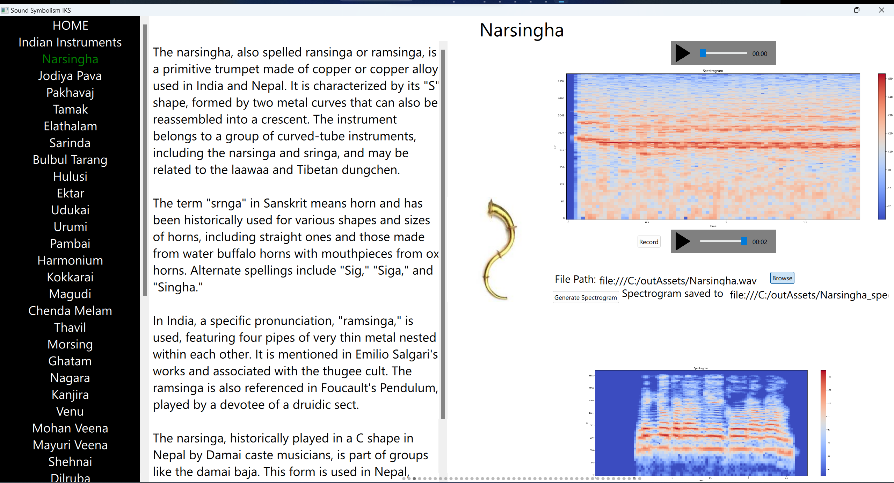
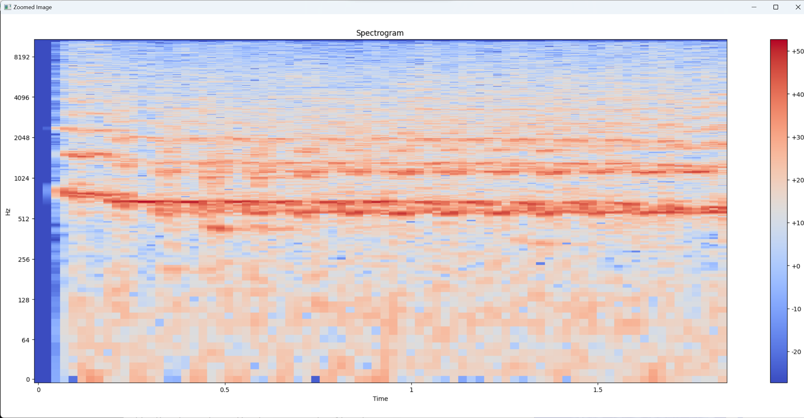

# Sound Symbolism App

Welcome to the Sound Symbolism App! This app was created with a minimalist user interface designed within a week. It utilizes the QML language and incorporates features such as Swipeview, swipe functionality, navbar, and audio play/record capabilities.

## Features

- **Minimalistic UI**: The user interface has been designed with simplicity and efficiency in mind, although it was developed within a short timeframe.
- **Swipe Functionality**: Users can navigate through different sections of the app using swipe gestures.
- **Navbar**: The app includes a navigation bar for easy access to different features and sections.
- **Audio Play/Record**: Users can play audio files and record/upload their own sounds directly within the app.

## Spectrogram Generation

The app generates spectrograms for audio files using a Python backend. It leverages libraries such as Librosa and Matplotlib to analyze and visualize the audio data. All images once clicked, w

## Screenshots

<!-- Add screenshots of your app in action here -->
<!-- Make sure to replace `screenshot.png` with the actual filename of your screenshot -->

## Instrument Variety

The app features a collection of 43 different instruments. Users can explore and interact with various sounds and symbols within the app. Instrument data collection was done by 2 other guys. My job was to integrate it in app.

## Usage

To use the Sound Symbolism App:

BINARIES HAVE NOT BEEN GENERATED.
1. Clone github repository.
2. Setup a new environment. Install packages pyside-6, librosa, matplotlib. Users may also need to install Qt for QtMultimedia to work properly.
3. Click on photos to open them in a new window and explore the detailed visuals of the spectograms.
